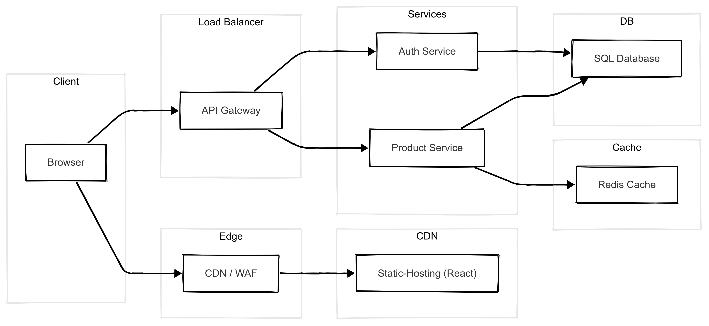

# Product Search Application

A modern full-stack application for listing and searching products with user authentication. Built with React, NestJS, and PostgreSQL in a Turborepo monorepo.

## 🏗️ Architecture Overview

### Current Implementation



### Key Components

- **Frontend (React)**: Single-page application with authentication and product search
- **Backend (NestJS)**: RESTful API with JWT authentication and caching
- **Database (PostgreSQL)**: Persistent storage for products and user data
- **Cache (Redis)**: Performance optimization for search results and sessions

## 🚀 Features

### ✅ Implemented Features
- **User Authentication**: JWT-based login system with protected routes
- **Product Listing**: Browse all products with responsive grid layout
- **Real-time Search**: Fast product search with query filtering
- **Responsive Design**: Mobile-first design optimized for all devices
- **Performance Caching**: Redis caching for search results and API responses
- **Error Handling**: Comprehensive error states and user feedback
- **Loading States**: Skeleton loaders and loading indicators

### 🔒 Authentication Flow
1. User visits protected routes → redirected to login
2. Login with email/password → JWT token generated
3. Token stored in localStorage → automatic API authentication
4. Protected routes accessible → search and browse products
5. Token validation on each API request

### 🔍 Search Capabilities
- Full-text search across product names, descriptions, and categories
- Case-insensitive query matching
- Real-time results as you type
- Empty state handling for no results
- Category-based filtering
- Price and metadata display

## 🛠️ Tech Stack

### Frontend
- **Framework**: React 19.1.0 with TypeScript
- **Build Tool**: Vite 6.3.5 for fast development and building
- **Styling**: Tailwind CSS 4.1.7 for responsive design
- **Routing**: React Router DOM 7.6.0 for navigation
- **HTTP Client**: Axios 1.9.0 for API communication
- **State Management**: React hooks and local storage

### Backend
- **Framework**: NestJS 11.0.1 with TypeScript
- **Authentication**: JWT tokens with Passport.js
- **Database**: PostgreSQL with connection pooling
- **Caching**: Redis with cache-manager integration
- **Testing**: Jest with comprehensive test coverage
- **Validation**: Built-in NestJS validation and guards

### Database & Cache
- **Primary Database**: PostgreSQL 15 with Alpine Docker image
- **Cache Layer**: Redis Alpine for performance optimization
- **ORM**: Native SQL queries with pg driver
- **Connection Pooling**: Configured for optimal performance

### DevOps & Tools
- **Monorepo**: Turborepo for efficient builds and task running
- **Package Manager**: npm with workspaces
- **Containerization**: Docker with multi-stage builds
- **Development**: Docker Compose for local environment
- **Code Quality**: ESLint, Prettier, TypeScript strict mode
- **Testing**: Jest for unit and e2e tests

## 📁 Project Structure

```
product-search/
├── apps/
│   ├── frontend/                 # React application
│   │   ├── src/
│   │   ├── public/
│   │   ├── Dockerfile
│   │   └── package.json
│   └── backend/                  # NestJS application
│       ├── src/
│       ├── test/                     # E2E and unit tests
│       ├── scripts/                  # Database initialization
│       │   └── init.sql              # Database Seeding SQL
│       ├── Dockerfile
│       └── package.json
├── packages/                     # Shared packages (future expansion)
│   ├── api-types/                    # Shared TypeScript types
│   ├── ui/                           # Shared UI components
│   └── utils/                        # Shared utilities
├── docker-compose.yml            # Local development environment
├── turbo.json                    # Turborepo configuration
└── package.json                  # Root package configuration
```

## 🚦 Getting Started

### Prerequisites
- Node.js 18+ 
- npm 8+
- Docker and Docker Compose (for local development)
- Git

### Quick Start with Docker

1. **Clone and start the application**
   ```powershell
   git clone <repository-url>
   cd product-search
   docker-compose up --build
   ```

2. **Access the application**
   - Frontend: http://localhost:3000
   - Backend API: http://localhost:3001/api
   - Database: localhost:5432
   - Redis: localhost:6379

3. **Demo Login Credentials**
   - Email: `user@example.com`
   - Password: `password`

### Development Setup

1. **Install dependencies**
   ```powershell
   npm install
   ```

2. **Start development servers**
   ```powershell
   # Start all services
   npm run dev
   
   # Or start individually
   cd apps/frontend && npm run dev    # Frontend on :3000
   cd apps/backend && npm run dev     # Backend on :3001
   ```

3. **Database Setup**
   ```powershell
   # Using Docker for development database
   docker-compose up postgres redis -d
   ```

### Available Scripts

```powershell
# Development
npm run dev              # Start all applications in watch mode
npm run build            # Build all applications for production
npm run lint             # Lint all code with ESLint
npm run format           # Format code with Prettier
npm run check-types      # TypeScript type checking

# Testing
cd apps/backend
npm run test             # Run unit tests
npm run test:e2e         # Run end-to-end tests
npm run test:cov         # Run tests with coverage
```

## 🔐 Authentication & Security

### Demo User Account
- **Email**: `user@example.com`
- **Password**: `password`
- **Token Expiry**: 1 hour

### Security Features
- JWT-based authentication with secure token storage
- Protected API routes with Passport.js guards
- CORS configuration for cross-origin requests
- Input validation and sanitization
- Error handling without sensitive data exposure

## 📊 Database Schema

### Products Table
```sql
CREATE TABLE products (
  id VARCHAR(50) PRIMARY KEY,
  name VARCHAR(255) NOT NULL,
  price DECIMAL(10,2) NOT NULL,
  image_url VARCHAR(500),
  description TEXT,
  category VARCHAR(100),
  created_at TIMESTAMP DEFAULT CURRENT_TIMESTAMP,
  updated_at TIMESTAMP DEFAULT CURRENT_TIMESTAMP
);
```

## 🔍 API Endpoints

### Authentication
- `POST /api/auth/login` - User login with email/password

### Products
- `GET /api/products` - List all products (requires authentication)
- `GET /api/products?q=search` - Search products by query

### Response Format
```json
{
  "products": [
    {
      "id": "p1",
      "name": "MacBook Pro 16\"",
      "price": 2499.00,
      "image_url": "https://...",
      "description": "Powerful laptop...",
      "category": "Laptops"
    }
  ]
}
```

## 📊 Performance Features

- **Redis Caching**: Search results cached for faster repeat queries
- **Database Indexing**: Optimized indexes on searchable fields
- **Connection Pooling**: PostgreSQL connection pool for scalability
- **Responsive Images**: Optimized image loading with fallbacks
- **Code Splitting**: Frontend bundle optimization
- **Lazy Loading**: Components loaded on demand

## 🚀 Production Deployment

### Environment Variables

**Backend (.env)**
```env
JWT_SECRET=your-secret-key
DB_HOST=your-db-host
DB_PORT=5432
DB_USER=postgres
DB_PASSWORD=your-password
DB_NAME=product
REDIS_HOST=your-redis-host
REDIS_PORT=6379
FRONTEND_URL=https://your-frontend-domain.com
```

**Frontend (.env)**
```env
VITE_API_BASE_URL=https://your-api-domain.com/api
```

## 🧪 Testing

### Test Coverage
- **Backend**: Unit tests for services and controllers
- **E2E Tests**: Complete authentication and search flows
- **API Tests**: All endpoints with various scenarios
- **Error Handling**: Invalid credentials, network errors, edge cases

### Running Tests
```powershell
cd apps/backend
npm run test           # Unit tests
npm run test:e2e       # Integration tests
npm run test:cov       # Coverage report
```

## 🔧 Future Enhancements

### Planned Features
- Pagination for large product lists
- Real-time inventory updates

### Architecture Evolution
- **Microservices**: Split into dedicated auth and product services
- **API Gateway**: Centralized routing and rate limiting
- **Event-Driven**: Product updates via message queues
- **CDN Integration**: Global content delivery
- **Advanced Caching**: Multi-layer caching strategy

## 🤝 Contributing

1. Fork the repository
2. Create a feature branch (`git checkout -b feature/amazing-feature`)
3. Run tests (`npm run test`)
4. Commit changes (`git commit -m 'Add amazing feature'`)
5. Push to branch (`git push origin feature/amazing-feature`)
6. Open a Pull Request


